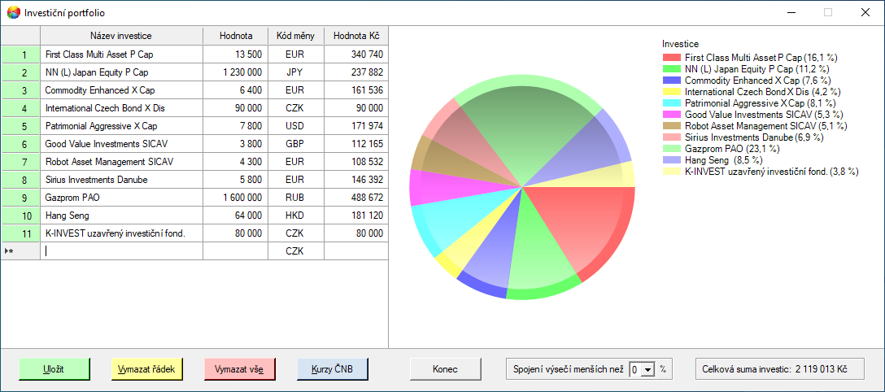
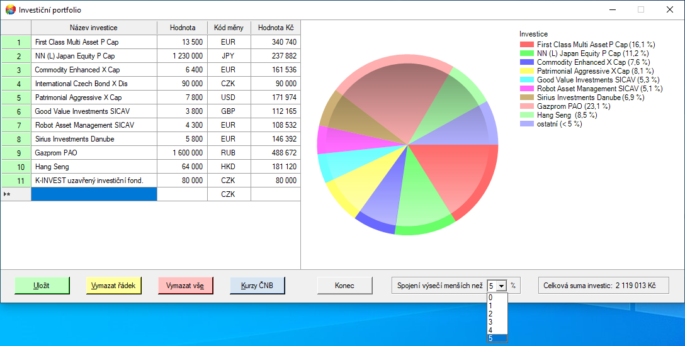
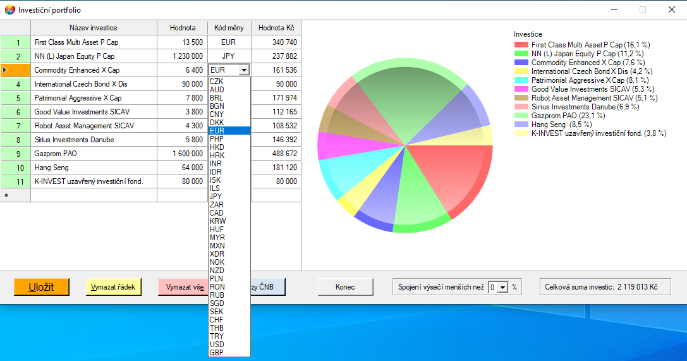
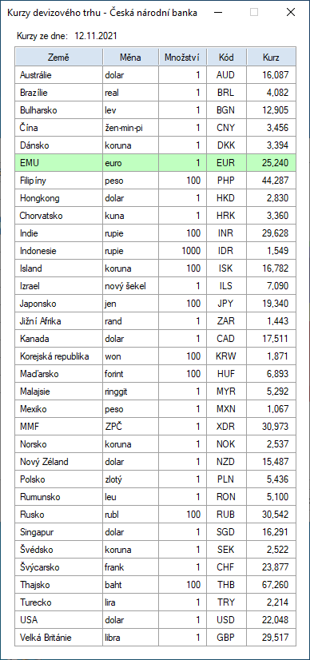

# Investiční portfolio
Aplikace pro evidenci investicí, stahování aktuálních devizových kurzů z API České národní banky a přepočet investicí v cizí měně na Kč. 
Přehled investic je zobrazen ve výsečovém grafu. 
Naprogramováno v jazyce C# v prostředí Microsoft .NET Framework 4.7.2

